# Анализ и Классификация Данных о Сердечно-Сосудистых Заболеваниях

## Описание Проекта
Этот проект направлен на анализ и классификацию данных о сердечно-сосудистых заболеваниях. Мы используем различные алгоритмы машинного обучения для создания и оценки моделей классификации, а также сегментации данных и обнаружения аномалий.

## Данные
Данные взяты из UCI Machine Learning Repository и содержат информацию о пациентах с сердечно-сосудистыми заболеваниями. Набор данных включает следующие признаки:
- возраст
- пол
- тип боли в груди
- артериальное давление в покое
- уровень холестерина
- уровень сахара в крови натощак
- результаты электрокардиографии в покое
- максимальная частота сердечных сокращений
- ангина, вызванная физической нагрузкой
- депрессия ST
- наклон ST
- количество сосудов, окрашенных флуороскопией
- талассемия
- наличие заболевания

## Предобработка Данных
- Заполнение пропущенных значений медианой
- Балансировка классов с использованием SMOTE
- Полиномиальные признаки
- Масштабирование данных

## Корреляционная матрица
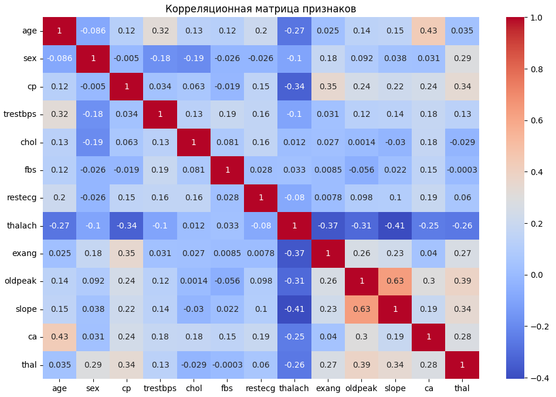

## Методы
### Классификация
Используемые алгоритмы классификации включают:
- Логистическая Регрессия

- Случайный Лес

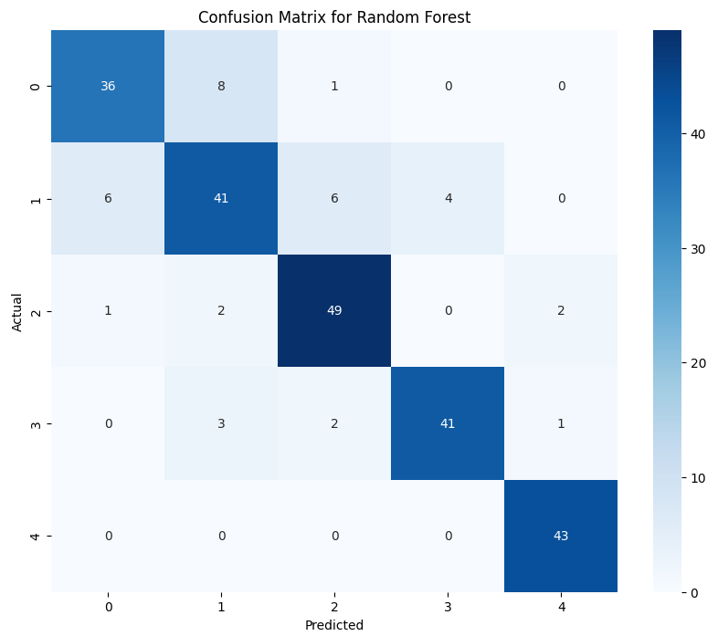

- Градиентный Бустинг

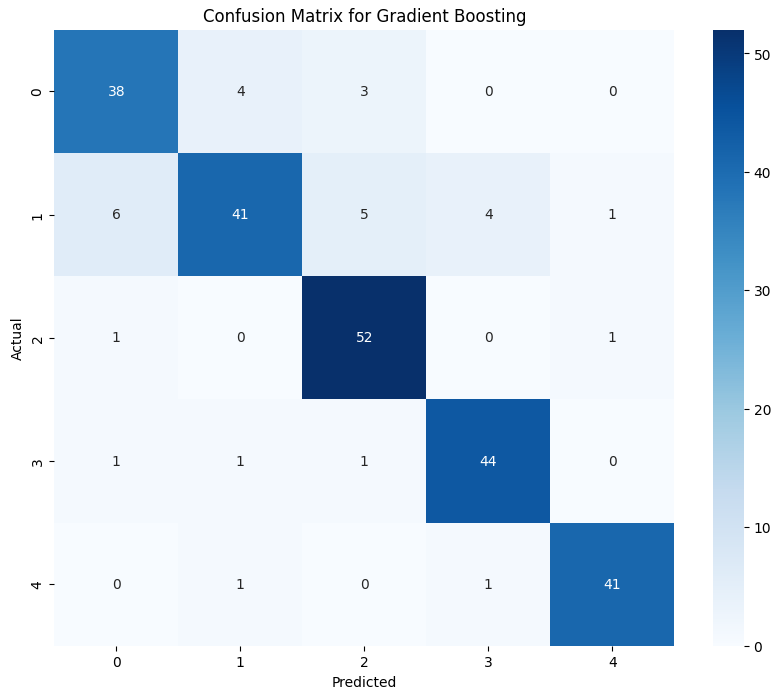

- Метод Опорных Векторов

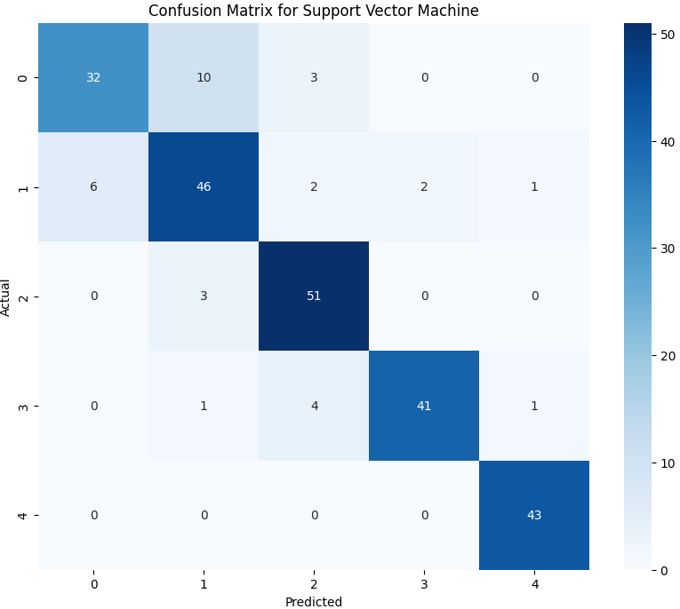

- K-ближайших соседей

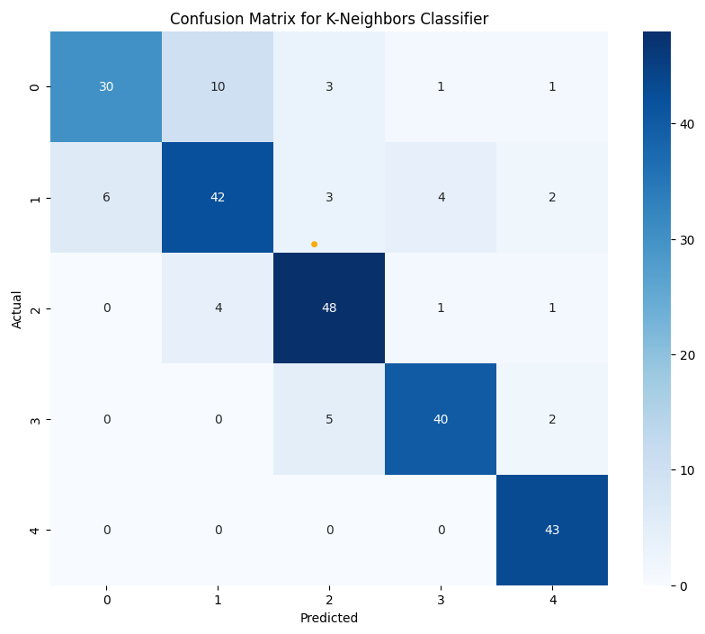

- XGBoost

- CatBoost

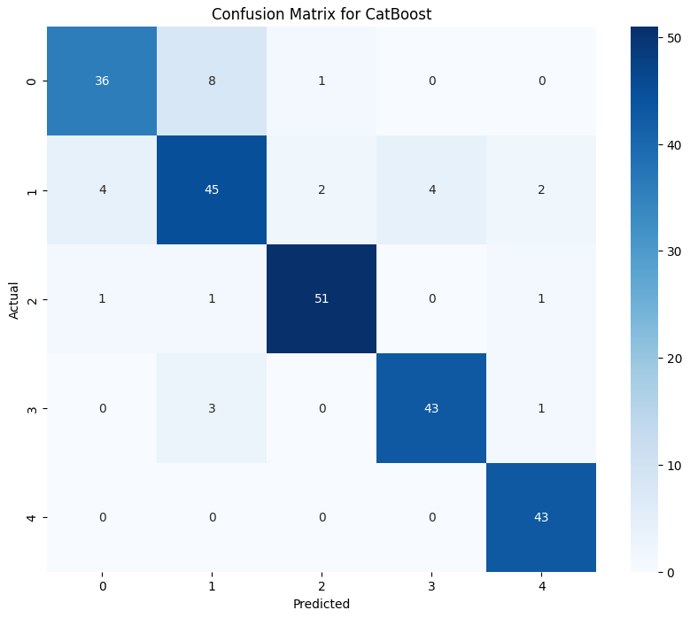

- Ансамблевое Моделирование с Voting Classifier

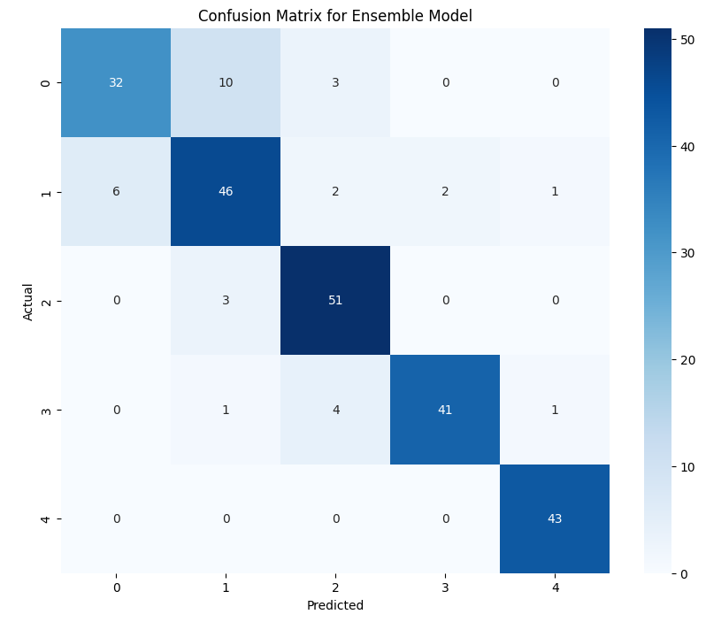

### Сегментация Данных
Сегментация данных выполнена с использованием алгоритма KMeans.

### Обнаружение Аномалий
Для обнаружения аномалий использовались следующие методы:
- Isolation Forest
- Local Outlier Factor
- One-Class SVM

## Результаты
### Точность Моделей
- Логистическая Регрессия: 0.7927
- Случайный Лес: 0.8537
- Градиентный Бустинг: 0.8780
- Метод Опорных Векторов: 0.8659
- K-ближайших соседей: 0.8252
- XGBoost: 0.8659
- CatBoost: 0.8862
- Ансамблевое Моделирование: 0.85

### Сегментация
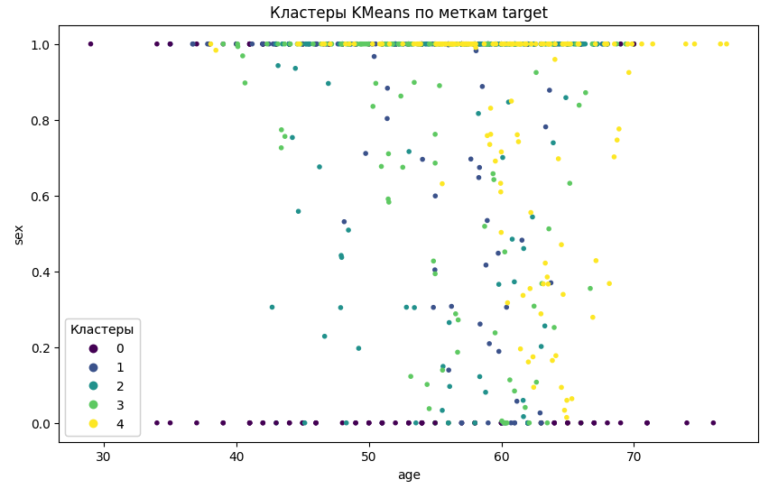

### Обнаружение Аномалий
#### Isolation Forest
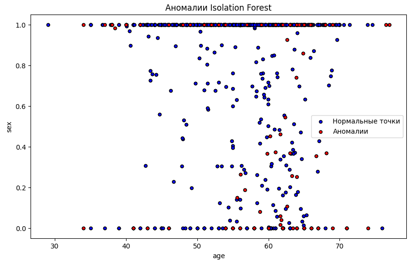

#### Local Outlier Factor
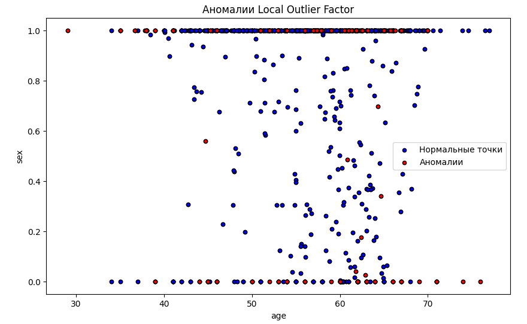

#### One-Class SVM
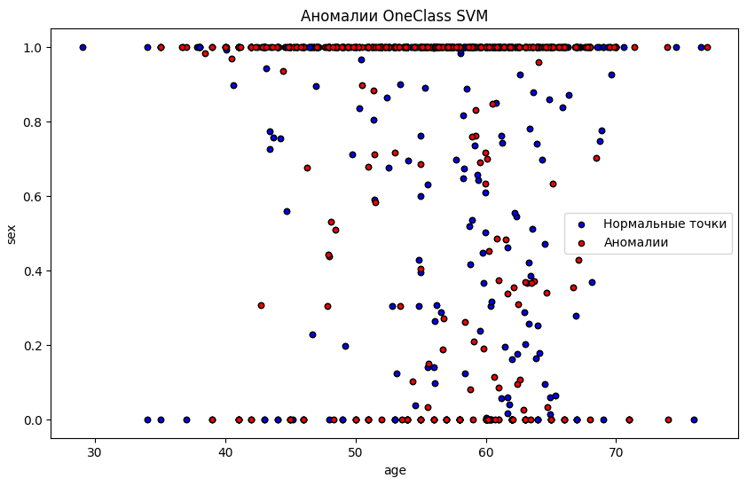

## Выводы
В ходе проекта мы использовали различные методы машинного обучения для анализа и классификации данных о сердечно-сосудистых заболеваниях. Наилучшие результаты показала модель CatBoost с точностью 0.8862. Методы обнаружения аномалий помогли выявить аномальные данные, которые могут требовать дополнительного внимания.
